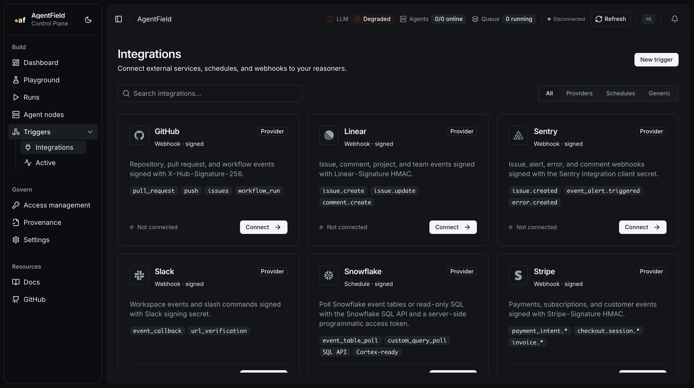

# Integrations

AgentField integrations are organized as modular packs in the repository.

Each pack can include:

- control-plane trigger source contracts,
- installable capability node manifests,
- node capability contracts,
- optional provider-native AI capability defaults when a pack includes them,
- implementation notes for provider-specific runtime code.

Current first-party integration design:

- [Snowflake](snowflake.md)
- [Linear](linear.md)
- [Sentry](sentry.md)

The canonical pack files live under `integrations/<provider>/`.

## UI Preview

Provider setup dialogs are linked from the provider pages:

- [Linear connect dialog](linear.md#ui)
- [Sentry connect dialog](sentry.md#ui)
