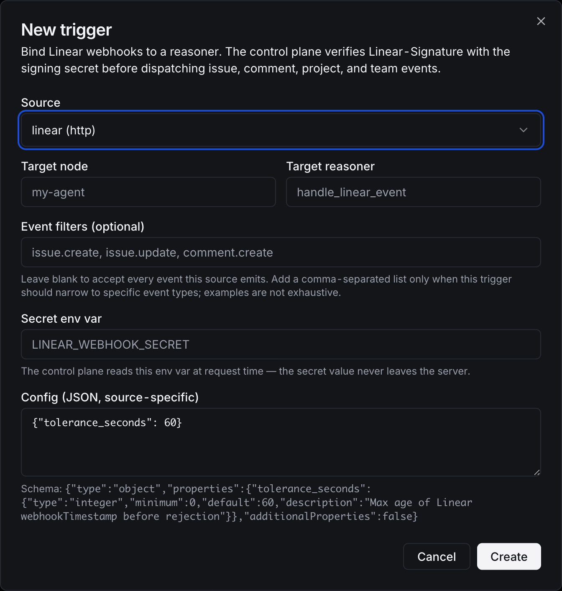

# Linear Integration

Linear is a first-party OSS integration in this repo. It includes a signed webhook source and a deterministic capability node.

## Control-Plane Source

Use source `linear` for Linear webhooks. Configure the Linear webhook URL to the AgentField trigger ingest URL and store the Linear signing secret in the control-plane env var referenced by the trigger, usually `LINEAR_WEBHOOK_SECRET`.

AgentField verifies `Linear-Signature`, rejects stale `webhookTimestamp` values by default, and emits event types such as `issue.create`, `issue.update`, and `comment.create`.

## UI

The dialog shows common event-type examples, the signing-secret env var, and the timestamp tolerance config. Event filters are optional; leave them blank when one trigger should accept every Linear event, including future event types Linear may add.

## Capability Node

Deploy the node when agents need Linear API operations:

- `get_issue` with `{ "id": "AF-123" }`
- `list_issues` with optional `{ "limit": 25 }`
- `create_issue` with `{ "input": { "teamId": "...", "title": "..." } }`
- `update_issue` with `{ "id": "...", "input": { "stateId": "..." } }`
- `comment_issue` with `{ "issue_id": "...", "body": "..." }`
- `list_teams` and `list_projects` for discovery

The node calls Linear GraphQL with `LINEAR_API_KEY`. It does not include triage, prioritization, or planning logic; keep that policy in your application layer.

## DX Path

1. Set `LINEAR_WEBHOOK_SECRET` on the control-plane process.
2. Create a `linear` trigger in the UI or API and point Linear webhooks at `/sources/<trigger_id>`.
3. Set `LINEAR_API_KEY` for the node when agents need read/write Linear API calls.
4. Run `integrations/linear/node`; set `LINEAR_NODE_PUBLIC_URL` when the control plane reaches it through a tunnel or container hostname.

For local development without a Linear account, set `LINEAR_API_URL` to a mock GraphQL server. The repo tests cover signature ingest and GraphQL client behavior with local fixtures.

## Real-Provider E2E Checklist

- Create a Linear webhook using the AgentField ingest URL.
- Send a real Linear issue or comment event and confirm the inbound event is persisted as `issue.*` or `comment.*`.
- Launch the Linear node with `LINEAR_API_KEY` and call `linear-prod.health`.
- Call at least one read capability, such as `get_issue`, and one safe write capability, such as `comment_issue` on a test issue.

## Source of Truth

- Pack: `integrations/linear/agentfield-package.yaml`
- Source contract: `integrations/linear/contracts/trigger-source.yaml`
- Capability contract: `integrations/linear/contracts/capabilities.yaml`
- Node: `integrations/linear/node/`
