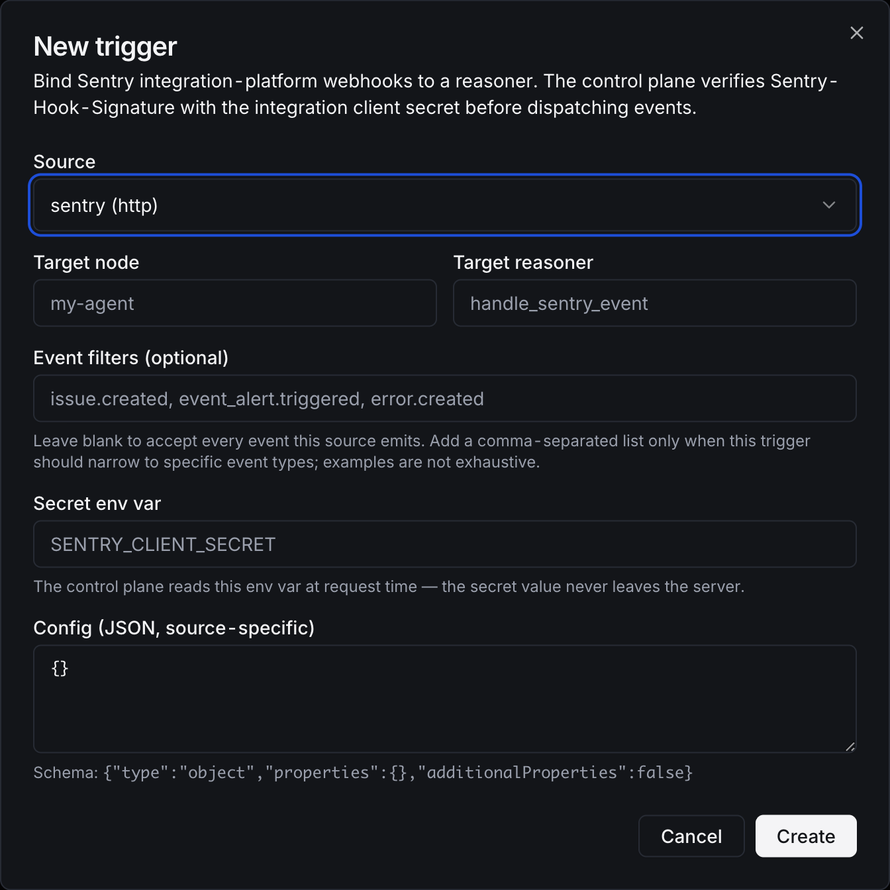

# Sentry Integration

Sentry is a first-party OSS integration in this repo. It includes an integration-platform webhook source and a deterministic capability node.

## Control-Plane Source

Use source `sentry` for Sentry webhooks. Configure the Sentry integration webhook URL to the AgentField trigger ingest URL and store the Sentry integration client secret in the control-plane env var referenced by the trigger, usually `SENTRY_CLIENT_SECRET`.

AgentField verifies `Sentry-Hook-Signature` and emits event types such as `issue.created`, `event_alert.triggered`, `metric_alert.triggered`, and `error.created`.

## Region / Base URL

Sentry's API base URL depends on your organization's data-storage region:

| Region | `SENTRY_BASE_URL` |
|--------|-------------------|
| Legacy US-only (default) | `https://sentry.io` |
| US region | `https://us.sentry.io` |
| **EU region (mandatory)** | `https://de.sentry.io` |
| Self-hosted Sentry | Your install's hostname |

**EU customers must set `SENTRY_BASE_URL` explicitly.** The default `https://sentry.io` will return 401/403 for EU-region orgs with no clear hint that the region is the cause. See [Sentry data storage location](https://docs.sentry.io/organization/data-storage-location/).

## UI

The dialog shows common issue, alert, and error event-type examples plus the client-secret env var. Event filters are optional; leave them blank when one trigger should accept every Sentry webhook resource, including future event types Sentry may add.

## Capability Node

Deploy the node when agents need Sentry API operations:

- `list_issues` with `{ "project": "web", "query": "is:unresolved" }`
- `get_issue` with `{ "issue_id": "123" }`
- `list_issue_events` with `{ "issue_id": "123" }`
- `get_event` with `{ "issue_id": "123", "event_id": "abc" }`
- `resolve_issue` with `{ "issue_id": "123" }`
- `assign_issue` with `{ "issue_id": "123", "assignee": "user:alice@example.com" }`
- `update_issue` for explicit Sentry issue fields

The node calls the Sentry REST API with `SENTRY_AUTH_TOKEN` and `SENTRY_ORG`. It only wraps explicit Sentry issue and event API operations.

## DX Path

1. Set `SENTRY_CLIENT_SECRET` on the control-plane process.
2. Create a `sentry` trigger in the UI or API and point the Sentry integration webhook at `/sources/<trigger_id>`.
3. Set `SENTRY_AUTH_TOKEN` and `SENTRY_ORG` for the node when agents need Sentry API calls.
4. Run `integrations/sentry/node`; set `SENTRY_NODE_PUBLIC_URL` when the control plane reaches it through a tunnel or container hostname.

For local development without a Sentry account, set `SENTRY_BASE_URL` to a mock Sentry API server. The repo tests cover signature ingest and REST client behavior with local fixtures.

## Real-Provider E2E Checklist

- Create a Sentry internal integration with webhooks enabled.
- Send a real issue, alert, or error webhook and confirm the inbound event is persisted as `issue.*`, `event_alert.*`, or `error.*`.
- Launch the Sentry node with `SENTRY_AUTH_TOKEN` and `SENTRY_ORG`, then call `sentry-prod.health`.
- Call at least one read capability, such as `get_issue`, and one safe write capability, such as `assign_issue` or `resolve_issue` on a test issue.

## Source of Truth

- Pack: `integrations/sentry/agentfield-package.yaml`
- Source contract: `integrations/sentry/contracts/trigger-source.yaml`
- Capability contract: `integrations/sentry/contracts/capabilities.yaml`
- Node: `integrations/sentry/node/`
